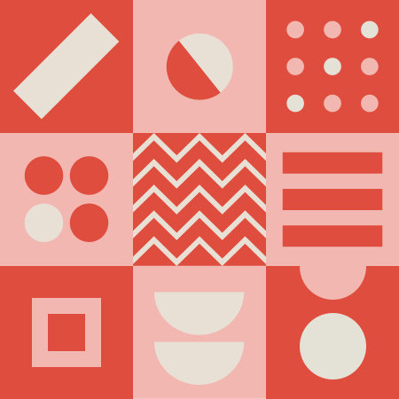
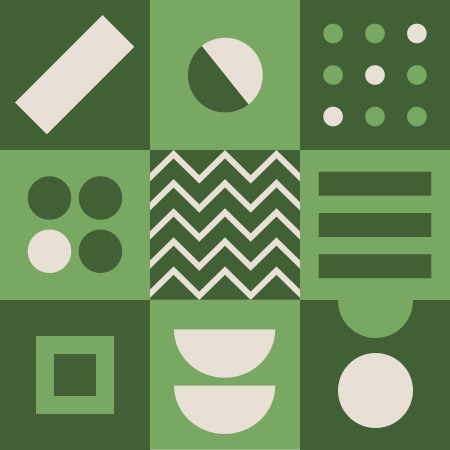
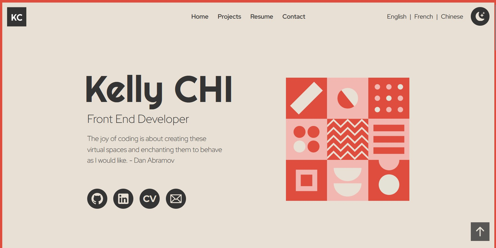
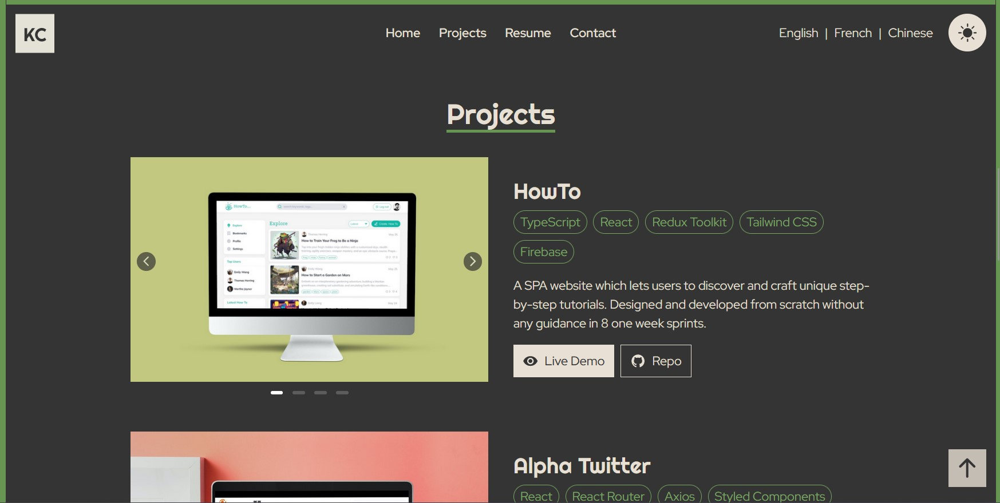
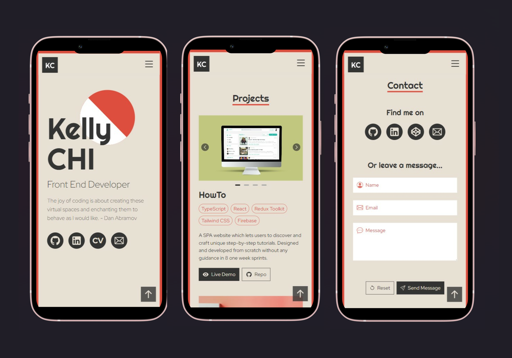
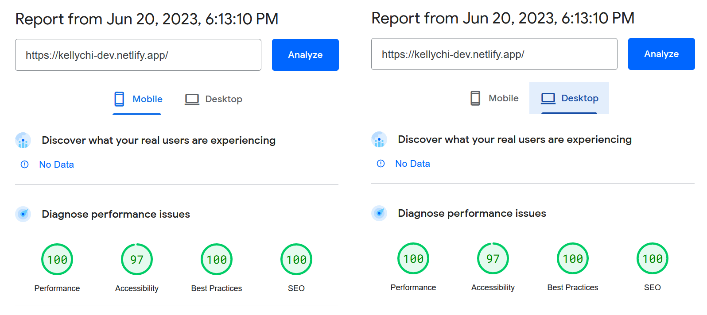
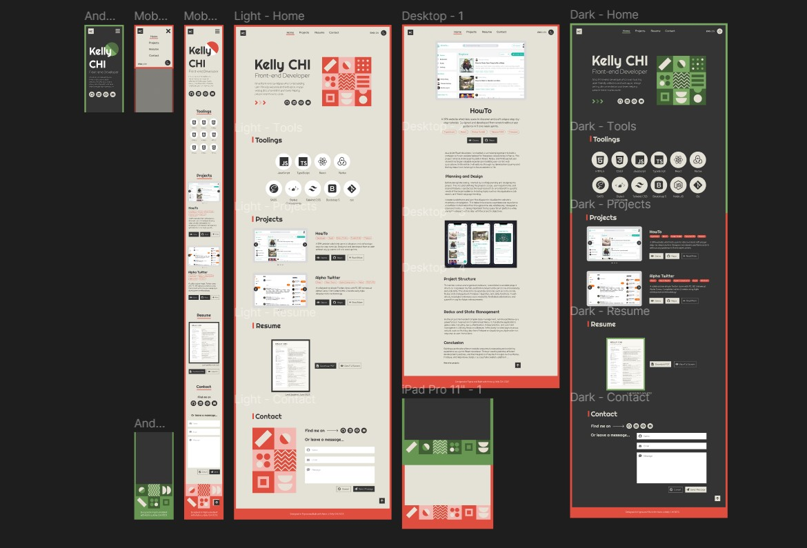

<div align="center">
  

# Portfolio v1

</div>

## 💡 Overview

My first personal portfolio showcasing projects that I've built for the past few months. Designed in Figma and built with Astro.js.

### 👀 Link: https://kellychi-dev.netlify.app

### 🧩 Built with

[](https://skillicons.dev)









## 🚀 Run locally

1. Clone this project to your local environment

```bash
$ git clone "https://github.com/KellyCHI22/portfolio.git"
```

2. Open the project and type the following command in your terminal

```bash
$ npm install
```

3. Continue with this command after finishing installing all the packages

```bash
$ npm run dev
```

4. Open your browser and navigate to the following path: `http://localhost:3000/`

5. Type the following command to stop the dev server

```bash
ctrl + c
```

## 💻 Tech Stack

### Core Technologies

- Astro 3.0.0
- React 18.2.0
- Tailwind CSS 3.3.2

### Packages

- astro-icon 0.8.1
- astro-i18next 1.0.0-beta.21
- clsx 1.2.1
- @iconify/react 4.1.0

### 🤯 Development Process

<details>
<summary>Click me</summary>

#### Design file



</details>

## 🔒 License

Copyright Notice and Statement: currently not offering any license. Permission only to view and download.
